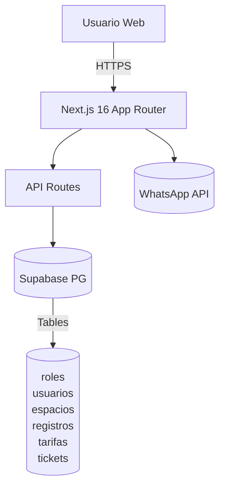

# ParkNidus - Sistema de Control de Parqueadero

**Desarrollado por Giseella Sanchez Rico**

[](https://github.com/gpsanchezr/ParkNidus)
[](https://supabase.com)

Sistema web **Cyberpunk** para control de parqueadero que cumple 100% con los requerimientos del proyecto:

- 30 espacios autos (15 sedan + 15 camioneta)
- 15 espacios motos  
- Cálculo automático tarifas (hora/minuto)
- Botón WhatsApp integrado
- Dashboard impactante Neon Pulse

## 🎮 Demo

```
npm install
npm run dev
```

**Credenciales**:
- Admin: `admin@parking.com` / `admin123`
- Operario: `operario@parking.com` / `oper123`

## 🏗️ Arquitectura



## 📋 Endpoints API

| Método | Endpoint | Descripción |
|--------|----------|-------------|
| GET | `/api/spaces` | Espacios disponibles + cupos |
| POST | `/api/vehicles` | Entrada vehículo |
| POST | `/api/vehicles/exit` | Salida vehículo + cobro |
| GET | `/api/reports` | Reportes ingresos |
| GET | `/api/tariffs` | Tarifas activas |
| GET | `/api/users` | Usuarios |

## 🚀 Supabase Setup

1. Ejecuta `scripts/supabase-schema.sql`
2. `.env.local` ya configurado
3. `npm i @supabase/supabase-js`

## 🎨 Neon Pulse Theme

```css
Primary: hsl(189 99% 55%) - Cyan Eléctrico
Secondary: hsl(271 74% 50%) - Violeta Profundo  
Accent: hsl(162 85% 45%) - Lima Neón
```

Modo oscuro por defecto, alto contraste cyberpunk.

## 📱 Features

✅ 45 espacios total (30 auto + 15 moto)  
✅ Cálculo tarifas reales  
✅ Autenticación rol-based  
✅ Reportes diarios  
✅ Tickets WhatsApp  
✅ Responsive shadcn/ui  
✅ TypeScript completo  

**Desarrollado por Giseella Sanchez Rico** 👩‍💻
