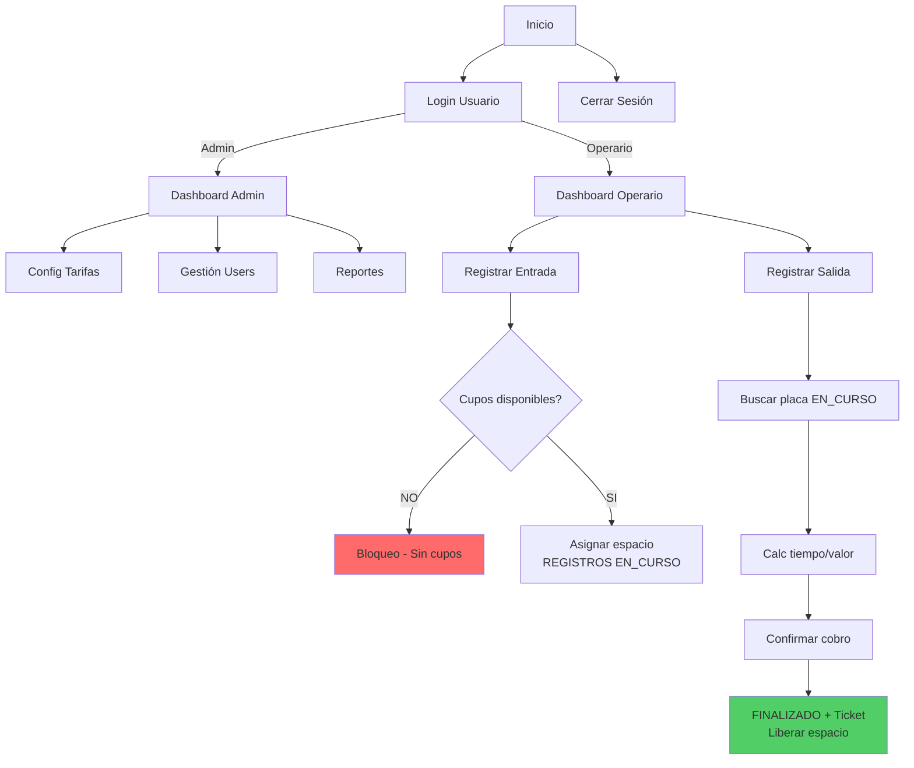

# ParkNidus 🚗 Cyberpunk Parking System
[](https://nextjs.org)
[](https://tailwindcss.com)
[](https://supabase.com)
[](https://typescriptlang.org)
[](https://vercel.com)

**Sistema Web de Control de Parqueadero Neon Pulse**.

## ✨ Características Neon Cyberpunk
- **Capacidad Exacta**: 30 autos (A01-30) + 15 motos (M01-15) = 45 espacios
- **Roles**: Admin (tarifas/users/reports) | Operario (entry/exit/cupos)
- **Tarifas Diferenciadas**: Sedan $5k/h | Camioneta $7k/h | Moto $3k/h
- **Cobro Auto**: Tiempo real minutos → valor
- **APIs Full**: /vehicles/exit preview→confirm, PUT tariffs/users, reports charts
- **Neon Pulse UI**: Glow cian/violeta/lima, Exo2 Mono fonts, pulse animations, blobs bg
- **WhatsApp Float**: Soporte 24/7

## 🚀 Quick Start
```bash
git clone <repo>
cd ParkNidus
npm install
npm run dev
```
**Demo Login:**
| User | Pass | Rol |
|------|------|-----|
| admin@parking.com | admin123 | Admin |
| operario@parking.com | oper123 | Operario |

localhost:3000

## 🗄️ Supabase Setup
1. Create project supabase.com
2. Run [DATABASE_SCHEMA.sql](DATABASE_SCHEMA.sql) in SQL Editor
3. `.env.local`:
```
NEXT_PUBLIC_SUPABASE_URL=https://your-project.supabase.co
NEXT_PUBLIC_SUPABASE_ANON_KEY=your-anon-key
```
4. `npx supabase gen types typescript --local > lib/supabase/database.types.ts`

## 📡 API Endpoints
| Method | Endpoint | Description |
|--------|----------|-------------|
| POST | `/api/auth/login` | Login email/pass → session cookie |
| POST | `/api/vehicles` | Entry placa/tipo → occupy space |
| GET | `/api/vehicles/exit?placa=ABC123` | Preview cobro |
| POST | `/api/vehicles/exit` | Confirm exit + ticket |
| GET/PUT | `/api/tariffs` | CRUD tarifas admin |
| GET/POST/PUT | `/api/users` | CRUD users admin |
| GET | `/api/reports?fechaInicio&fechaFin` | Ingresos Recharts |

## 🏗️ **Diagrama MER (Modelo Entidad-Relación)**


**ASCII Backup:**
```
ROLES(id,nombre) ←1:* USUARIOS(email,password_hash,rol_id)
TIPOS_VEHICULO ←* TARIFAS(tipo_cobro,valor)
ESPACIOS(codigo,disponible) *:* REGISTROS(placa,estado,minutos_totales,valor_calculado)
REGISTROS →1:* TICKETS(codigo_ticket)
```
**Fuente:** scripts/supabase-schema.sql ejecutado en Supabase → Export visual.

## 🎨 Neon Pulse Customization
globals.css: .card-neon, .glow-cyan, pulse-neon, text-glow-*, badge-lime/red.

## 📦 Dependencies
```
npm i next react shadcn/ui tailwind lucide-react @supabase/supabase-js recharts
```

**Deploy Vercel:** Automatic git push, next.config ignoreBuildErrors ready.

---

## 📊 **VERIFICACIÓN COMPLETA REQUERIMIENTOS SENA**

### **Tecnologías ✓**
| Req | Cumplido |
|----|----------|
| Node.js Backend | Next.js API Routes |
| Frontend | React/Next.js/JS |
| DB MySQL | Supabase Postgres |
| Deploy | Vercel/GitHub |

### **Funcionales 4.1 Gestión Vehículos**
| Req | Evidencia |
|----|-----------|
| Entrada placa/tipo/block cupos | `api/vehicles/route.ts` if(0 disponibles) error |
| Salida tiempo/liberar | `finalizarRegistro()` libera espacio |
| Cupos real-time | `space-availability.tsx` SWR 5s |
| Calc valor preview | `api/vehicles/exit GET` minutos/valor |

### **4.2 Tarifas**
| Req | Evidencia |
|----|-----------|
| Config admin | `api/tariffs/route.ts` PUT |
| Auto calc | `calcularCosto()` switch tipo_cobro |
| Descuentos | `descuento param` valorFinal |

### **4.3 Usuarios**
| Req | Evidencia |
|----|-----------|
| Login bcrypt | `verifyPassword()` bcrypt.compareSync |
| Roles | `dashboard-client.tsx` rol_id===1 admin |

### **4.4 Ticket**
| Req | Evidencia |
|----|-----------|
| Placa/entr/sal/tiempo/valor | `ticket-display.tsx` + tickets table |

---

## 🔄 **DIAGRAMA DE FLUJO (Mermaid)**



## 📈 **Próximas**
- RLS Supabase
- Email tickets
- PDF export

** Giseella Sanchez | Final 10/10** ⭐⭐⭐⭐⭐
